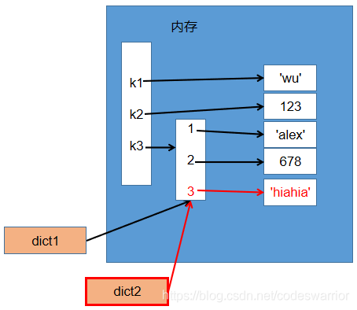

---
title: Python变量存储方式以及深浅拷贝
date: 2021-08-10 23:49:04
author: 乔亚峰
top: true
toc: true
mathjax: false
summary: Python 的赋值语句不复制对象，而是创建目标和对象的绑定关系。对于自身可变，或包含可变项的集合，有时要生成副本用于改变操作，而不必改变原始对象。
categories: Python
tags:
  - Python
  - 博客
---


# Python变量存储方式以及深浅拷贝

## 变量存储

Python是动态语言。

可以把任意数据类型赋值给变量，无需提前声明变量类型，同一个变量可以反复赋值，而且可以是不同类型的变量。

下面引用廖雪峰Python教程的简单例子，描述变量存储过程：  

当我们写：`a = 'ABC'`时，Python解释器干了两件事情：
    1. 在内存中创建了一个'ABC'的字符串；
    2. 在内存中创建了一个名为a的变量，并把它指向'ABC'。

下面程序：


```python
a = 'ABC'
b = a
a = 'XYZ'
print(b)
```

    ABC


执行过程：

执行a = 'ABC'，解释器创建了字符串'ABC'和变量a，并把a指向'ABC'：


执行b = a，解释器创建了变量b，并把b指向a指向的字符串'ABC'：


执行a = 'XYZ'，解释器创建了字符串'XYZ'，并把a的指向改为'XYZ'，但b并没有更改： 


所以，最后打印变量b的结果自然是'ABC'了。

## 深浅拷贝

Python当中对于拷贝，按照拷贝数据类型分为两种类型。一种是数字和字符串的拷贝，另一种就是列表、元组、字典等其他数据结构类型的拷贝。

当然按照深浅也分深拷贝和浅拷贝。

### 一、数字和字符串拷贝

#### 1、= 赋值

举例：


```python
a1 = 123
a2 = 123
print(id(a1))
print(id(a2))
```

    140710205171168
    140710205171168


原因是Python有一个重用机制，对于同一个数字，Python并不会开辟一块新的内存空间，而是维护同一块内存地址，a1，a2变量指向数字123的地址。等同于a2 = a1，使用字符串赋值也是同理。

结论：对于通过用 = 号赋值，数字和字符串在内存当中用的都是同一块地址。

### 2、浅拷贝

举例：


```python
import copy  # 使用浅拷贝需要导入copy模块
a1 = 123
a3 = copy.copy(a1)  # 使用copy模块里的copy()函数就是浅拷贝
print(id(a1))
print(id(a3))
```

    140710205171168
    140710205171168


发现地址还是一样。

结论：对于浅拷贝，数字和字符串在内存当中用的也是同一块地址，和上面讲的原理相同。

### 3、深拷贝

举例：


```python
import copy
a1 = 123
a4 = copy.deepcopy(a1)  # 深拷贝是用copy模块里的deepcopy()函数
print(id(a1))
print(id(a4))
```

    140710205171168
    140710205171168


发现地址还是一样。

结论：对于深拷贝，数字和字符串在内存当中用的也是同一块地址，和上面讲的原理相同。

综上所述，对于数字和字符串的赋值、浅拷贝、深拷贝在内存当中用的都是同一块地址。


### 二、字典，列表，元组等数据结构类型拷贝

#### 1、=赋值

举例：


```python
dict1 = {'k1': 'wu', 'k2': 123, 'k3': {1: 'alex', 2: 678}}
dict2 = dict1
print(id(dict1))
print(id(dict2))
```

    2052328224064
    2052328224064


dict2变量只是指向了同一份字典数据的地址，如下图所示：


理解了上面的图我们看一下下面的代码：


```python
dict1 = dict1['k3']
dict2 = dict1
dict2[3] = 'hiahia'
print(dict1)
```

    {1: 'alex', 2: 678, 3: 'hiahia'}


我们逐步看怎么执行的：
```
dict1 = dict1['k3']
```


```
dict2 = dict1
```


```
dict2[3] = 'hiahia'
```



#### 2. 浅拷贝

举例：


```python
import copy
dict1 = {"k1": "wu", "k2": 123, "k3": {1: 'alex', 2: 678}}
dict3 = copy.copy(dict1)  # 浅拷贝
print("第一层字典的内存地址：")
print(id(dict1))
print(id(dict3))
print("第二层嵌套的列表的内存地址：")
print(id(dict1["k3"]))
print(id(dict3["k3"]))
```

    第一层字典的内存地址：
    2052330241600
    2052330293440
    第二层嵌套的列表的内存地址：
    2052330293184
    2052330293184


结果发现字典第一层确实被拷贝了，变成了两个，但第二层还是共用相同的数据，如下图：


结论：所以对于浅拷贝，字典、列表、元组等类型，它们只拷贝第一层地址。

#### 3、深拷贝

举例：


```python
import copy
dict1 = {"k1": "wu", "k2": 123, "k3": {1: 'alex', 2: 678}}
dict4 = copy.deepcopy(dict1)  # 深拷贝
print("第一层字典的内存地址：")
print(id(dict1))
print(id(dict4))
print("第二层嵌套的列表的内存地址：")
print(id(dict1["k3"]))
print(id(dict4["k3"]))
print("第三层嵌套的列表的内存地址：")
print(id(dict1["k3"][1]))
print(id(dict4["k3"][1]))
```

    第一层字典的内存地址：
    2052330294976
    2052330239616
    第二层嵌套的列表的内存地址：
    2052330238656
    2052330240128
    第三层嵌套的列表的内存地址：
    2052330238704
    2052330238704


发现一二层被拷贝了，最底层的数字和字符串数据依然共用，如下图：


结论：对于深拷贝，字典、列表、元组等类型，它里面嵌套多少层，就会拷贝多少层出来，但是最底层的数字和字符串地址不变。


[参考文章1](https://www.liaoxuefeng.com/wiki/1016959663602400/1017063826246112) 

[参考文章2](https://blog.csdn.net/codeswarrior/article/details/107103665)
